# Inference workflows for the {{ projectname }} project

This is the place to put workflow generation scripts. The purpose of these scripts is to take a set of parameters and construct a workflow, by chaining a sequence tasks defined in *sinnfull.tasks*.

## Anatomy of a workflow

Typically there will be three files associated to one workflow:

A _workflow template_  
~ Given some parameters, creates a sequence of tasks to execute.

- A _workflow generator_
~ Executes the _workflow template_ with different parameters.

- A definition of _workflow parameters_
~ Exposes the parameters expected by the _workflow template_.

% NB: The link to the footnote is fragile: assumes there are no other footnotes.
:::{margin}  
There is also an experimental function which does not use papermill. See the [footnote below](#id2).
:::

Of these, only the _workflow template_ is strictly necessary. A _workflow generator_ is a very simple script that uses [papermill](https://papermill.readthedocs.io/en/latest/) (through `sinnfull.utils.generate_task_from_nb`) to execute the template [^1]. This is extremely useful e.g. for repeating fits with different hyperparameters or initializations.

In order to work with papermill, the _workflow template_ must [tag](https://papermill.readthedocs.io/en/latest/usage-parameterize.html) ONE cell at the top with “parameters” and define all parameterizable variables in that cell.

_Workflow parameters_ are defined by subclassing [`WorkflowParams`](./workflow_parameters). The main benefits of doing this are:
- It documents all workflow parameters, including their types, in one place.
- Parameter sets can be manipulated in code.  
  This is especially useful for defining ensembles of parameters (a.k.a. *parameter spaces*) with minimal boilerplate.
- One can of define derived parameters, derived defaults and validation functions.
For more information, see `mackelab_toolbox.parameters.ComputedParams`.

## Example workflow

The diagram below shows a possible workflow for running an optimizer. The contents of the “Optimize Task Workflow” box is very close to the workflow implement by [Optimize workflow template](./Optimize_WF_template ).

- _Dotted_ lines indicate either optional branches, OR conceptual relationships.
- _Hexagonal_ nodes indicate [Tasks](../tasks/index).
  These are executed when the workflow is _run_.
- _Rounded_ nodes indicate computations executed when the workflow is _constructed_.
- _Square_ nodes are used for any concept which does not fall into the two categories above.

% source: workflow-flowchart-mermaid-source.txt

[^1]: While functional, the use of papermill isn't ideal. First because it has about a 2.5 s overhead, which when generating dozens of tasks can add many minutes. Second, the fact that papermill serializes all the parameters with `repr` before passing them means that additional care is required for any non-standard classes. This also seems to make executing the notebooks in parallel more difficult.

      There is an alternative function `sinnfull.utils.run_as_script` which attempts to bypass papermill altogether. It's still WIP, but may become the recommendation in the future.
